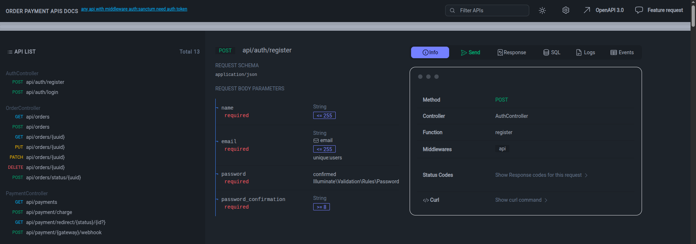

# Order and Payment Management API

## Setup Instructions

1. Clone repository (https://github.com/mahmoudhaggag641/order-payment-api.git)
2. Copy `.env.example` to `.env` by `cp .env.example .env` and configure DB and gateway env keys
3. Run `composer install`
4. Run `php artisan key:generate`
5. Run migrations: `php artisan migrate`

## API Documentation

You can view the API documentation by.

1. You can visit the following URL in your local environment to see and test all endpoints:

    👉 [http://localhost/request-docs](http://localhost/request-docs)

    

2. Or The `order_payment_api.json` file in the root of the repository is exported from previous step/page by clicking on `OpenAPI 3.0` button.
3. And you can Import `order_payment_api.json` into Postman or any other tool.

## Payment Gateway Extensibility

The system uses Strategy Pattern for payment gateways. To add a new gateway:

1. Create a class implementing `PaymentGatewayInterface` in `app/Services/Payment/`.
2. Add it to `config/payment.php` under `gateways`
3. Add configuration in `.env` if needed
4. The `PaymentService` will automatically pick up method => class mapping.

    Example shown in 
    - `app/Services/Payment/Gateways/Stripe.php` 
    - `app/Services/Payment/Gateways/PayPal.php` 

5. I used webhook way, because it is more secure `server-to-server` and recommended by all payment providers.
6. And you can use `/api/payment/{gateway_name}/webhook` route to using it with any payment gateway.

## Testing

Run `php artisan test` for feature and unit tests.
